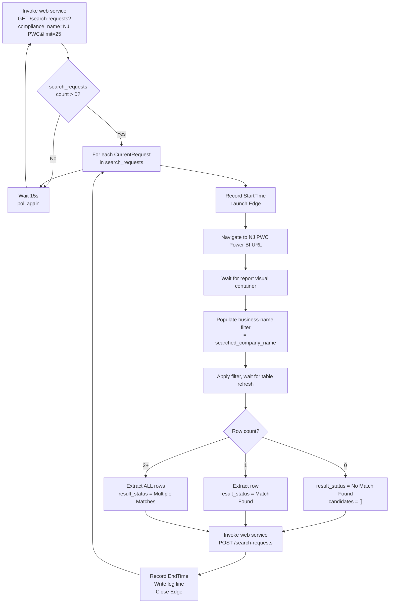

# SubTracker — NJ PWC PAD Worker Build (Phase 2, Sprint 2)

Operational build guide for the first working **Power Automate Desktop (PAD) flow** that searches the NJ Public Works Contractor Registration Power BI report and submits candidate matches into SubTracker.

> **Sprint 2 scope:** build the working flow for the three happy-path outcomes. The contract is defined in `docs/NJ_PWC_PAD_WORKER.md` (Sprint 1); this document is the concrete action-by-action build.
>
> **First version supports only:** `Match Found` · `Multiple Matches` · `No Match Found`.
> **Deferred to Sprint 3:** `Website Error`, `RPA Error` classification, and retry optimizations.

---

## Explicitly unchanged

This worker touches **only** the two integration endpoints below. It does **not** modify the Search Request Queue, Candidate Modal, Import Workflow, Sync History, Review Queue, or Approval Workflow — all validated and working.

| Endpoint | Method | Purpose |
|---|---|---|
| `/api/integrations/compliance-sync/search-requests` | GET | Poll pending requests |
| `/api/integrations/compliance-sync/search-requests` | POST | Submit candidate matches |

**Auth header on every call:** `x-subtracker-rpa-key: <COMPLIANCE_SYNC_RPA_KEY>` — store as a PAD **sensitive variable** named `RpaKey`. Never hardcode, log, or place in a URL.

---

## Flow overview

Flow name: **`SubTracker - NJ PWC Search`**



---

## PAD action list

Numbered in build order. Variable names are the contract — keep them exact.

### Setup (once, top of flow)

| # | PAD action | Configuration |
|---|---|---|
| 1 | **Set variable** `BaseUrl` | `https://<your-subtracker-host>/api/integrations/compliance-sync/search-requests` |
| 2 | **Set variable** `ReportUrl` | `https://app.powerbigov.us/view?r=eyJrIjoiZmY1YmVjMzktMjc5ZS00NzQxLWFkMWQtYjYzZGRmN2JhNTViIiwidCI6IjUwNzZjM2QxLTM4MDItNGI5Zi1iMzZhLWUwYTQxYmQ2NDJhNyJ9` |
| 3 | **Set variable (sensitive)** `RpaKey` | value of `COMPLIANCE_SYNC_RPA_KEY` |
| 4 | **Set variable** `PollIntervalSeconds` | `15` |

### 1. Queue polling

| # | PAD action | Configuration |
|---|---|---|
| 5 | **Invoke web service** | Method `GET`; URL `'%BaseUrl%?compliance_name=NJ%20PWC&limit=25'`; Request header `x-subtracker-rpa-key: %RpaKey%`; Save response into `PollResponse` |
| 6 | **Convert JSON to custom object** | `PollResponse` → `PollJson` |
| 7 | **If** `PollJson.search_requests.Count > 0` | else branch → **Wait** `15s` → loop back to step 5 |
| 8 | **For each** `CurrentRequest` **in** `PollJson.search_requests` | process sequentially |

### 2. Browser launch + report load

| # | PAD action | Configuration |
|---|---|---|
| 9 | **Set variable** `StartTime` | `%CurrentDateTime%` |
| 10 | **Launch new Microsoft Edge** | URL `%ReportUrl%`; Launch mode: New instance; Window state: Normal; Save to `Browser` |
| 11 | **Wait for web page content** | Browser `Browser`; Wait until element containing the report visual container is available; Timeout `60s` |

### 3. Search interaction

| # | PAD action | Configuration |
|---|---|---|
| 12 | **Populate text field** (business-name filter) | Browser `Browser`; UI element = filter input selector; Text `'%CurrentRequest.searched_company_name%'` |
| 13 | **Click / press Enter** on the filter apply control | Browser `Browser`; UI element = apply button selector |
| 14 | **Wait for web page content** | Wait until the result table visual finishes refreshing (loading spinner disappears) |

### 4. Candidate extraction

| # | PAD action | Configuration |
|---|---|---|
| 15 | **Extract data from web page** | Browser `Browser`; target = result table visual; Extraction mode = table; Save to `ResultTable` (data table) |
| 16 | **Handle pagination** | If a "next page" control exists and is enabled, click it, wait for refresh, and **append** rows to `ResultTable`; repeat until exhausted |
| 17 | **Set variable** `RowCount` | `ResultTable.RowsCount` |

### 5. Candidate mapping + submission

| # | PAD action | Configuration |
|---|---|---|
| 18 | **Build candidates JSON** — loop `For each Row in ResultTable`, append one object per row to `CandidatesList` (mapping below) |
| 19 | **Classify** | `RowCount = 0` → `ResultStatus = "No Match Found"`, `CandidatesList = []`; `= 1` → `"Match Found"`; `> 1` → `"Multiple Matches"` |
| 20 | **Invoke web service** | Method `POST`; URL `%BaseUrl%`; header `x-subtracker-rpa-key: %RpaKey%`; Body = submission payload below; Save response into `SubmitResponse` |
| 21 | **Set variable** `EndTime` | `%CurrentDateTime%` |
| 22 | **Write PAD log line** | see Logging workflow |
| 23 | **Close Edge** | Browser `Browser` |

---

## Browser launch steps

- **Engine:** Microsoft Edge, **new instance per request** (never reuse across requests — avoids stale filter state and cross-request contamination).
- **Window state:** Normal (visible). Do not run headless in Sprint 2 — the first runs must be observable.
- **Session:** launch with a clean profile state; closing after each request resets cookies/report cache.
- **Failure to launch** in Sprint 2: let the flow fail the request and move on (RPA Error classification arrives in Sprint 3).

---

## Power BI load handling

The report renders inside an embedded iframe with an asynchronous canvas. **Never use fixed delays or screen coordinates.**

| Stage | Wait strategy |
|---|---|
| Initial load | **Wait for web page content** on the report visual container selector, timeout 60 s |
| After applying filter | **Wait for web page content** until the table's loading indicator clears / row count stabilizes |
| Between pagination clicks | Wait for the table refresh after each page turn |

If the visual container never appears within 60 s, the Sprint 2 behavior is to submit `No Match Found` is **wrong** — instead let the action throw; proper `Website Error` handling is Sprint 3. For now, a thrown action fails the request, the browser is closed, and the flow continues to the next request.

---

## Selector strategy

Capture selectors with the PAD **UI element** recorder against the live report, and store them in the flow's UI-elements repository. Use **CSS / UIA selectors relative to the report surface**, ordered by stability:

1. Prefer `data-*` attributes and stable `id` / `name` attributes Power BI emits on visuals.
2. Fall back to `role` + `aria-label` combinations.
3. Avoid positional selectors (`:nth-child`, index paths) and anything containing dynamic session tokens.

| UI element | Selector guidance |
|---|---|
| Business-name filter input | `input` within the search/slicer visual; anchor on its `aria-label` or placeholder text |
| Filter apply control | button/checkbox adjacent to the filter input; anchor on accessible name |
| Result table visual | the table/grid container; anchor on its `role="grid"` or the visual's title text |
| Pagination "next" control | the page-forward button; verify an "enabled/disabled" attribute to detect the last page |
| Loading indicator | the report's spinner/busy element; used for refresh waits |

**Record the actual selectors chosen** in a table appended to this document after the first attended run, so a layout change is diagnosable.

---

## Table extraction approach

- Use PAD **Extract data from web page** in **table** mode against the result-table visual into a `ResultTable` data table with columns: `BusinessName, RegistrationDate, ExpirationDate, Address, City, State, ZipCode, County, CertificateNumber`.
- **Read via the accessible UI tree** — never OCR or pixel scraping.
- **Pagination:** loop the next-page control while enabled; append each page's rows to `ResultTable`. Stop when the control is disabled.
- **Cap:** submit at most 50 candidates; if `ResultTable.RowsCount > 50`, truncate to the first 50 (server also caps).
- **Row integrity:** if the expected columns are not all present in `ResultTable`, the layout changed — in Sprint 2 let the flow fail the request rather than post partial-column data (classified properly in Sprint 3).

---

## Candidate mapping

One `CandidatesList` object per `ResultTable` row:

```json
{
  "business_name": "%Row.BusinessName%",
  "certificate_number": "%Row.CertificateNumber%",
  "registration_date": "%ToIsoDate(Row.RegistrationDate)%",
  "expiration_date": "%ToIsoDate(Row.ExpirationDate)%",
  "address": "%Row.Address%",
  "city": "%Row.City%",
  "state": "%Row.State%",
  "zip_code": "%Row.ZipCode%",
  "county": "%Row.County%",
  "source_url": "%ReportUrl%"
}
```

**Field rules**

- `business_name` — required; skip any row where it is blank.
- `certificate_number`, `zip_code` — keep as **text**; preserve leading zeros; never convert to number.
- `registration_date` / `expiration_date` — convert the displayed date to ISO `YYYY-MM-DD`; if not displayed, emit `null`. **Never fabricate a date.**
- Trim whitespace on all text fields.
- Rows are returned exactly as displayed — no filtering, ranking, or auto-selection. The SubTracker candidate modal handles selection.

---

## Submission process

**POST** `%BaseUrl%` with header `x-subtracker-rpa-key: %RpaKey%` and body:

```json
{
  "search_request_id": "%CurrentRequest.id%",
  "result_status": "%ResultStatus%",
  "candidates": "%CandidatesList%",
  "source_url": "%ReportUrl%"
}
```

| `RowCount` | `result_status` | `candidates` |
|---|---|---|
| 0 | `No Match Found` | `[]` |
| 1 | `Match Found` | 1 object |
| 2+ | `Multiple Matches` | all objects (≤ 50) |

**Success response** `200 OK`:

```json
{ "ok": true, "search_request_id": 17, "status": "completed", "candidate_count": 1 }
```

Sprint 2 treats any non-200 as a failed request: log it, close the browser, continue. Retry/backoff refinement is Sprint 3.

---

## Logging workflow

Maintain a local CSV log `NJ_PWC_PAD_log.csv` on the workstation. **Append one line per processed request** after the POST resolves:

```
SearchRequestId,CompanyName,StartTime,EndTime,ResultStatus,CandidateCount
17,"ABCO ELECTRIC, LLC",2026-10-06T13:04:02,2026-10-06T13:04:31,Match Found,1
```

| Field | Source variable |
|---|---|
| Search Request ID | `CurrentRequest.id` |
| Company Name | `CurrentRequest.searched_company_name` |
| Start Time | `StartTime` (step 9) |
| End Time | `EndTime` (step 21) |
| Result Status | `ResultStatus` |
| Candidate Count | `CandidatesList.Count` |

**Never log:** `RpaKey`, Supabase keys, passwords, tokens, cookies. On a failed submission, append a `,ERROR <http status>` suffix to the line.

---

## First-run checklist

1. Confirm `RpaKey` sensitive variable is set and a GET poll returns `200`.
2. Attended run with a known single match (`ABCO ELECTRIC, LLC`) → verify `Match Found`, 1 candidate, all 9 fields populated.
3. Attended run with a broad term (`ABCO`) → verify `Multiple Matches`, all rows returned.
4. Attended run with a nonsense name → verify `No Match Found`, `candidates = []`.
5. Verify the candidate modal renders worker results identically to simulator results, County included.
6. Record the final selectors in the Selector strategy table above.
