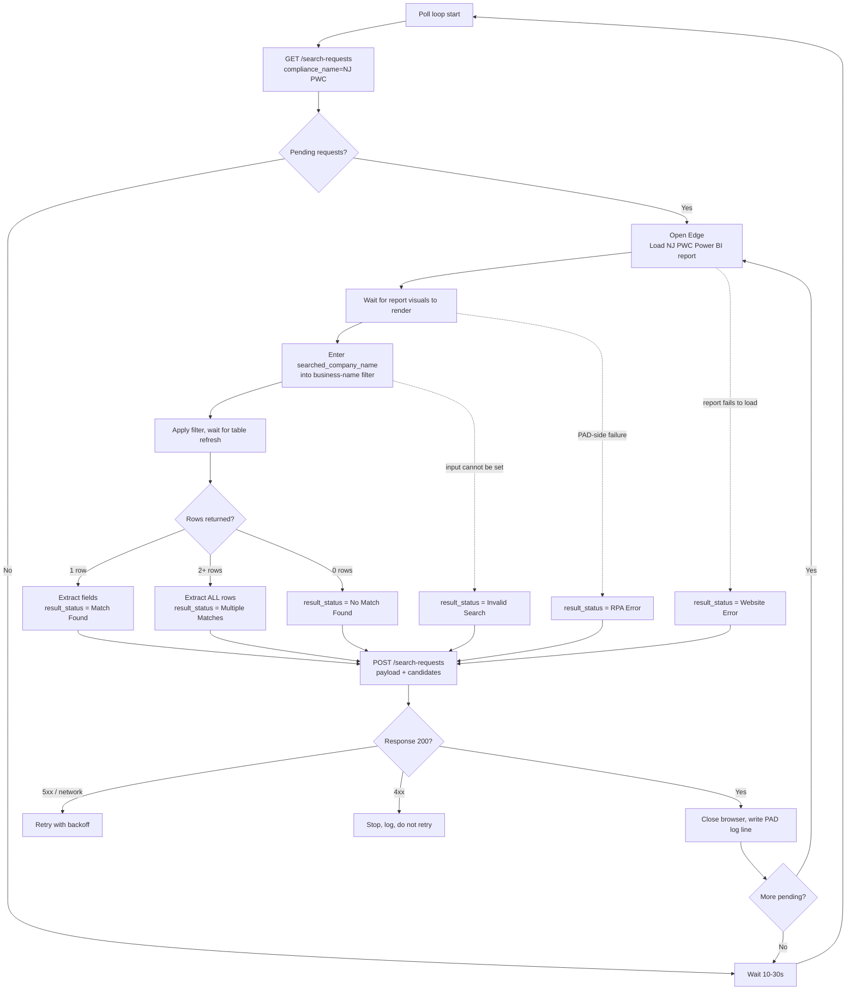

# SubTracker — NJ PWC Power Automate Desktop Worker (Phase 2, Sprint 1)

Design and API contract for the **Power Automate Desktop (PAD) worker** that replaces the **Create Test NJ PWC Result** simulator with live searches against the NJ Public Works Contractor Registration Power BI report.

> **Sprint 1 scope: documentation and API contract only.** The PAD flow is **not** built in this sprint. No SubTracker code changes are required — every endpoint referenced here is already live and validated. **Create Test NJ PWC Result** remains available for testing until the worker is validated in production.

---

## Explicitly unchanged

This worker plugs into the existing pipeline. It does **not** modify:

- Search Requests (`compliance_sync_search_requests` creation from the Add Contractor form)
- Candidate Modal (NJ PWC Registry Matches)
- Import Workflow (`POST /api/contractors/nj-pwc-import`)
- Sync Runs
- Review Queue
- Approval Workflow
- Sync History

The worker touches **only** the two integration endpoints below. Everything downstream (candidate modal → selection → import → synced record → review queue) is unchanged and already validated.

---

## PAD architecture

```
┌──────────────────┐   poll    ┌─────────────────────────────┐   query   ┌────────────────────┐
│ compliance_sync_ │ ◄──────── │  PAD Worker                 │ ────────► │ NJ PWC Power BI    │
│ search_requests  │           │  "SubTracker - NJ PWC       │           │ Report             │
│ (status=pending) │ ────────► │   Search"                   │ ◄──────── │ (app.powerbigov.us)│
└──────┬───────────┘  submit   │  Edge + UI automation       │   rows    └────────────────────┘
       │                       └──────────────┬──────────────┘
       ▼                                      │
 Candidate Modal ◄────────────────────────────┘
 (existing, unchanged)
```

- **Trigger model:** polling loop (10–30 s interval), not scheduled batch and not SubTracker-pushed.
- **Browser:** Microsoft Edge, one instance per request, closed after submission.
- **Automation mode:** UI-automation / CSS selectors relative to the Power BI report surface. **Never fixed screen coordinates** — Power BI renders inside an embedded iframe with an asynchronous canvas.
- **Concurrency:** one request at a time, strictly sequential. Power BI visuals re-render per filter; parallel sessions risk cross-contaminated results.
- **Credential:** `COMPLIANCE_SYNC_RPA_KEY` stored as a PAD **sensitive variable**. Never hardcoded, never in URL query params, never logged.

Flow diagram:



---

## 1. Queue polling workflow

**Endpoint:** `GET /api/integrations/compliance-sync/search-requests`

**Query parameters**

| Parameter | Value | Notes |
|---|---|---|
| `compliance_name` | `NJ PWC` | Fixed for this worker |
| `limit` | `25` | Positive integer, server-capped at 100 |

**Request header**

```
x-subtracker-rpa-key: <COMPLIANCE_SYNC_RPA_KEY>
```

**Response** `200 OK`

```json
{
  "search_requests": [
    {
      "id": 17,
      "compliance_name": "NJ PWC",
      "searched_company_name": "ABCO ELECTRIC, LLC",
      "searched_zip_code": "07001",
      "searched_city": "AVENEL",
      "searched_state": "NJ",
      "created_at": "2026-10-06T13:02:41.000Z"
    }
  ]
}
```

**Polling rules**

- Only `status = 'pending'` requests are returned, oldest first.
- Empty array → wait 10–30 s → poll again. Do not busy-loop.
- The worker processes requests sequentially in the order returned.
- Requests are claimed implicitly by submitting results; there is no separate "claim" call. If two workers ever run, results are keyed by `search_request_id` — the second submission of a completed request is rejected by server-side status checks (a non-pending request update is a no-op-safe path; treat HTTP errors here as fatal for that item, not the worker).

---

## 2. Search workflow

Per pending request:

1. Record **Start Time** (see Logging design).
2. Open a new Microsoft Edge instance.
3. Navigate to the NJ PWC source:

   ```
   https://app.powerbigov.us/view?r=eyJrIjoiZmY1YmVjMzktMjc5ZS00NzQxLWFkMWQtYjYzZGRmN2JhNTViIiwidCI6IjUwNzZjM2QxLTM4MDItNGI5Zi1iMzZhLWUwYTQxYmQ2NDJhNyJ9
   ```

4. **Wait for report render** — wait on the report visual container element, not a fixed delay. Recommended max wait: 60 s. Timeout → `Website Error`.
5. Locate the **business-name search/filter visual** via UI-automation selector.
6. Enter `searched_company_name` **exactly as received** (already normalized by SubTracker: trimmed, single-spaced, uppercased). If the input cannot be set → `Invalid Search`.
7. Apply/confirm the filter and **wait for the result table to refresh** (watch for the table visual's loading state to clear).
8. Proceed to candidate extraction.

**Confirmed behavior to rely on:**

| Input | Expected outcome |
|---|---|
| `ABCO` | Multiple rows → `Multiple Matches` |
| `ABCO ELECTRIC, LLC` | Single row → `Match Found` |

**Do not** pre-filter, fuzzy-match, or rank rows in PAD. Return everything the report displays.

---

## 3. Candidate extraction workflow

The result table displays these columns:

| Power BI column | Candidate field | Rule |
|---|---|---|
| Business Name | `business_name` | **Required** — a row without it is skipped |
| Certificate Number | `certificate_number` | Text; preserve leading zeros; never convert to number |
| Registration Date | `registration_date` | Convert display format → ISO `YYYY-MM-DD`; null if absent |
| Expiration Date | `expiration_date` | Convert → `YYYY-MM-DD`; **null if not displayed — never fabricate** |
| Address | `address` | Text, trimmed |
| City | `city` | Text, trimmed |
| State | `state` | Text, trimmed |
| ZIP Code | `zip_code` | Text; preserve leading zeros |
| County | `county` | Text, trimmed |
| — | `source_url` | Report URL (same for all rows in a request) |

**Extraction rules**

- Enumerate **all** visible rows in the result table visual.
- **Pagination:** if the table visual pages, iterate every page before submitting. Candidate cap: **50** (server-capped; excess rows are dropped server-side).
- Read cells via the accessible UI tree (UIA), never pixel/OCR scraping.
- If a required column is missing from the visual (report layout changed) → abort the request with `Website Error` and a descriptive `error_message`. **Never post partial-column data.**
- Row count classification:
  - 1 row → `Match Found`
  - 2+ rows → `Multiple Matches`
  - 0 rows → `No Match Found`

**Multiple Matches:** return **all** matching rows. Do **not** auto-select. The SubTracker candidate modal already handles selection.

---

## 4. Result submission workflow

**Endpoint:** `POST /api/integrations/compliance-sync/search-requests`

**Request header**

```
x-subtracker-rpa-key: <COMPLIANCE_SYNC_RPA_KEY>
```

### API request contract

```json
{
  "search_request_id": 17,
  "result_status": "Match Found",
  "candidates": [
    {
      "business_name": "ABCO ELECTRIC, LLC",
      "certificate_number": "064321",
      "registration_date": "2024-03-15",
      "expiration_date": "2026-03-31",
      "address": "123 RAHWAY AVE",
      "city": "AVENEL",
      "state": "NJ",
      "zip_code": "07001",
      "county": "MIDDLESEX",
      "source_url": "https://app.powerbigov.us/view?r=..."
    }
  ],
  "error_message": null,
  "source_url": "https://app.powerbigov.us/view?r=..."
}
```

| Field | Required | Rules |
|---|---|---|
| `search_request_id` | Yes | Existing request → else 400/404 |
| `result_status` | Yes | One of the supported statuses below → else 400 |
| `candidates` | For matches | 0–50 items; rows without `business_name` are dropped |
| `error_message` | For errors | Required for `Invalid Search`, `Website Error`, `RPA Error` |
| `source_url` | No | Top-level report URL |

**Supported `result_status`:** `Match Found` · `Multiple Matches` · `No Match Found` · `Invalid Search` · `Website Error` · `RPA Error`

### API response contract

**`200 OK`**

```json
{ "ok": true, "search_request_id": 17, "status": "completed", "candidate_count": 1 }
```

Stored `status` mapping: `Match Found` / `Multiple Matches` → `completed`; `No Match Found` → `no_match`; error statuses → `failed`.

**Error responses** — all `{"error": "..."}`:

| Code | Meaning | Worker action |
|---|---|---|
| 400 | Validation failure | Do **not** retry without correction; log and move on |
| 401 | Missing/invalid RPA key | Stop the worker — configuration fault |
| 404 | Request not found | Do not retry; log and move on |
| 5xx | Server error | Retry per retry strategy |

Every successful submission writes an `administration_audit_log` entry server-side. After submission, the Add Contractor form's existing polling picks up candidates and renders the candidate modal — no worker involvement.

---

## 5. Error handling design

| Condition | `result_status` | `error_message` example |
|---|---|---|
| Report page fails to load / visuals time out | `Website Error` | "NJ PWC Power BI report did not render within 60s." |
| Search input cannot be located or set | `Invalid Search` | "Business-name filter visual not found on report." |
| Result table renders with missing columns (layout changed) | `Website Error` | "Expected column 'Certificate Number' not present in result table." |
| Table read fails mid-extraction | `Website Error` | "Result table changed during extraction; aborted." |
| Browser crash / PAD action failure | `RPA Error` | "Edge instance terminated unexpectedly." |
| Any human-verification / sign-in / access-control prompt | `RPA Error` | "Human Verification Required" — **never solve, bypass, or evade**; escalate per the NJ BRC hard rules |
| 0 result rows | `No Match Found` | null |

Hard rules:

- Never submit fabricated or partial candidates; when in doubt, fail the request.
- One bad request never kills the worker: log, submit the error status, close the browser, continue to the next request.
- On `Website Error`, do not retry the website within the same request — the request is recorded `failed` and can be re-run by an Administrator.
- Every failure closes the browser instance before the next request (clean session state).

---

## 6. Retry strategy

Retries apply **only to the result-submission POST**, never to the website interaction:

| Failure | Strategy |
|---|---|
| Network error / 5xx on POST | Up to **3 attempts**, exponential backoff: 5 s → 15 s → 45 s. Idempotent-safe: server keys results on `search_request_id`; a resubmitted request that already completed is rejected rather than duplicated |
| 400 on POST | No retry — fix the payload |
| 401 on POST | Stop worker immediately; alert Administrator (key misconfiguration) |
| 404 on POST | No retry — the request was deleted or already resolved |
| GET polling failures | Up to 3 attempts (30 s apart), then keep the loop alive on a 5-minute cool-down |

---

## PAD logging design

The worker maintains its own local run log (CSV or PAD log table) on the workstation, separate from SubTracker's server-side audit log. **One line per processed request**, written after the result POST resolves:

| Field | Source |
|---|---|
| Search Request ID | `search_request_id` from the polling payload |
| Company Name | `searched_company_name` |
| Start Time | Recorded before opening the browser |
| End Time | Recorded after the POST resolves |
| Result Status | The `result_status` submitted |
| Candidate Count | `candidates.length` submitted |

Example line:

```
17, "ABCO ELECTRIC, LLC", 2026-10-06T13:04:02, 2026-10-06T13:04:31, "Match Found", 1
```

**Never logged:** the RPA key, Supabase keys, passwords, tokens, or cookies. Submission failures additionally log the HTTP status and server `error` message (which contains no secrets).

---

## Validation checklist (before Phase 2 Sprint 2)

1. Worker polls and receives pending requests (200, auth accepted).
2. `ABCO` search returns all rows → submitted as `Multiple Matches` with every candidate present.
3. `ABCO ELECTRIC, LLC` search returns exactly one candidate → `Match Found`, all 10 fields populated (county included).
4. Candidate modal renders worker results identically to simulator results.
5. `is_test = false` rows only from the worker; **Create Test NJ PWC Result** remains available in Administration → Compliance Sync for regression testing.
6. Review Queue, Sync History, and approval workflow show no behavioral change.
